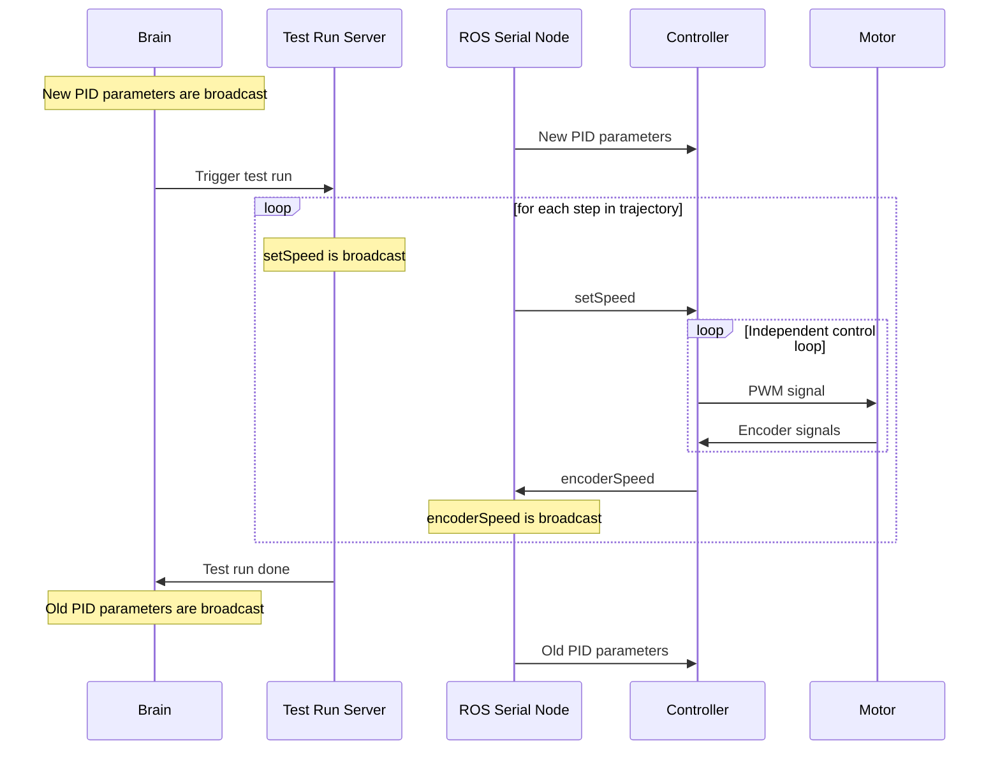

# MLMC

## Table of contents
1. [Abstract](#abstract)
2. [Hardware](#hardware)
3. [Software](#software)
5. [Results](#results)

## Abstract
[ROS](https://www.ros.org/)-based project for automatically optimizing PID settings of a motorcontroller with genetic algorithms using the [DEAP](https://github.com/DEAP/deap) framework. Communication with motor controller is implemented via [rosserial](https://github.com/ros-drivers/rosserial). 

> PIDs can be tuned easier, faster and safer in software. This repo is for educational purposes only.

## Hardware
[Pololu Baby Orangutan B-328 Robot Controller](https://www.pololu.com/product/1220) is used to drive a generic geared DC motor with a low-quality encoder (similar to [this](https://www.pololu.com/product/4805)). Motor voltage is supplied by an external bench power supply at 7V. A [USB-to-Serial bridge](https://www.sparkfun.com/products/9873) implements a communication interface to the main PC and supplies 5V.


## Software

The PID controller is translated into a genetic representation as a list object containing P-, I-, D- and several custom feed-forward control parameters. Using the [DEAP](https://github.com/DEAP/deap) framework, a population of individuals with randomly chosen parameters is created. 

The fitness of each individual is determined by the function `evaluate_individual`. After publishing the individuals PID parameters via the ROS network as a custom message, it triggers a physical test run using a [ROS service](http://docs.ros.org/en/api/std_srvs/html/srv/Trigger.html). The `test_run_server.py` offers three waveform generators that may be used to generate many different trajectories. By default, a squarewave is generated to evaluate a step response. It is continuously broadcast to the ROS network as `setSpeed`. A ROS serial node sends the message via UART to the controller. The controller reads the input signal, actuates the motor and evaluates the encoder feedback. It returns the calculated `encoderSpeed` to the ROS serial node that publishes it to the network. The function `evaluate_individual` reads `setSpeed` and `encoderSpeed` from the ROS network and calculates the mean squared error over the duration of a test run to determine the fitness of the individual. Once the test run is completed, known-good PID parameters are send to the controller so the motor can stabilize before the next test run.

A sequence diagram of the `evaluate_individual` function is shown below:



After each individual has a fitness value attached, a new generation is created using mutation and cross-over. The new generation is again evaluated until a fitness threshold is passed or until a predefined number of generations is reached.

### Setup
```
git clone git@github.com:Finn2708/MLMC.git
cd MLMC/catkin_ws
catkin_make clean
catkin_make install
source devel/setup.bash
```

### (Optional) Building custom message files
```
cd MLMC/PIO/lib
rosrun rosserial_arduino make_libraries . mlmc_msgs
```

### Usage
To launch the entire project, run:

```
cd catkin_ws
source devel/setup.bash
roscore
roslaunch mlmc mlmc.launch
```

Training will start immediately with params defined in `brain.py`. A preconfigured `rqt_plot` window will show current and set speeds of the motor.


## Results

### Mean Squared Error

The diagram below shows result for a population size of 100 and ten generations. After only two generations, an individual close to the all-time champion was found. After 9 generations, the average result stops improving.

Overall, it is evident that mean squared error (MSE) is not ideal to tune the controller because of the high frequency noise induced.

